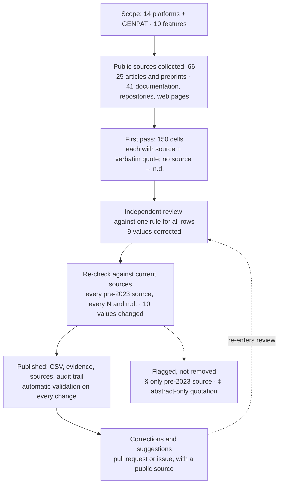

# Methodology

## Scope

Platforms used for bacterial and viral genomic surveillance, chosen to cover the main architectural patterns:
curated typing databases (BIGSdb-Pasteur, PubMLST, EnteroBase), analysis services (CGE, Pathogenwatch),
installable platforms (IRIDA, IRIDA Next, Galaxy), national or supranational surveillance systems (AusTrakka,
NCBI Pathogen Detection, the EFSA One Health WGS System) and viral platforms (Nextstrain, GISAID,
Pathoplexus). The list is not exhaustive; proposals to add a platform are welcome.

## Features

Ten features (D1–D10, see the README), chosen because they bear on how a platform can serve several
institutions: where it runs, under which licence, who owns and sees the data, whether the metadata and the
analyses can be extended without code, which organisms it covers, how results are visualised, whether it
exchanges data with repositories or authorities, and whether it integrates with a laboratory information
system; and whether it accepts raw sequencing reads or only assembled or consensus sequences (D10,
added on 2 October 2026 at a reader's suggestion).

## Sources

The authors hold no accounts on most of the platforms, so values are taken only from sources that anyone can
check:

1. official sources of the platform: documentation, licence files, source repositories (README, releases,
   issues, pull requests), release notes, FAQs, terms of use, and presentations by its developers;
2. scholarly publications: peer-reviewed articles, and preprints identified as such.

For each cell, the source and a verbatim passage of at most about 40 words supporting the value are recorded
in `evidence/EVIDENCE.md`. A value is never inferred: if no source states a feature, the cell is **n.d.**,
and **N** requires a source stating that the feature is not available.

## Uniform rule across rows

The table compares different kinds of object: a hosted web service, the software underlying it, and plug-ins
or third-party integrations. To keep rows comparable:

- **Y** — the feature is a core function of the service or software named in the row;
- **P** — the feature is available only through the software underlying a hosted service (marked †),
  through a plug-in, an external component or a third-party integration, or only in part;
- **N** — a source states that the feature is not available (for D2, also code that is source-available
  under a non-open-source licence or without a licence);
- **n.d.** — no source was found.

## Procedure

1. **First pass (2 October 2026).** For each platform and feature, primary sources were searched and the
   supporting passage recorded. DOI metadata were checked on Crossref or the publisher's page.
2. **Independent review.** The table and the evidence were reviewed against the rule above; values that did
   not follow it (licences that are not open source, functions available only through underlying software,
   organism coverage) were corrected.
3. **Re-check against current sources (2 October 2026).** Every cell resting only on a source older than
   2023, and every N or n.d., was re-checked against current documentation, release notes, repositories and
   recent presentations, to avoid describing a platform by an outdated publication. Seven values changed:
   for example, a LIMS module cited from 2010 had been removed from the software in 2019, and a platform
   described in 2016 had been withdrawn. The audit trail is in sections (c) and (d) of
   `evidence/EVIDENCE.md`.
4. Cells for which no newer source exists are marked §; cells whose quotation could be verified only on an
   abstract are marked ‡.

## Limitations

- The values are what could be learned from public sources only; the authors hold no accounts on most of
  the platforms and could not verify undocumented features.
- The table describes documented features, not quality or suitability, and is not a ranking.

- "n.d." means not documented, not absent.
- Values describe each platform as documented on the date in `last_checked`; platforms change.
- Documentation may describe features that are not enabled on a given instance.
- The GENPAT row is described by its authors (see the disclosure in the README).
